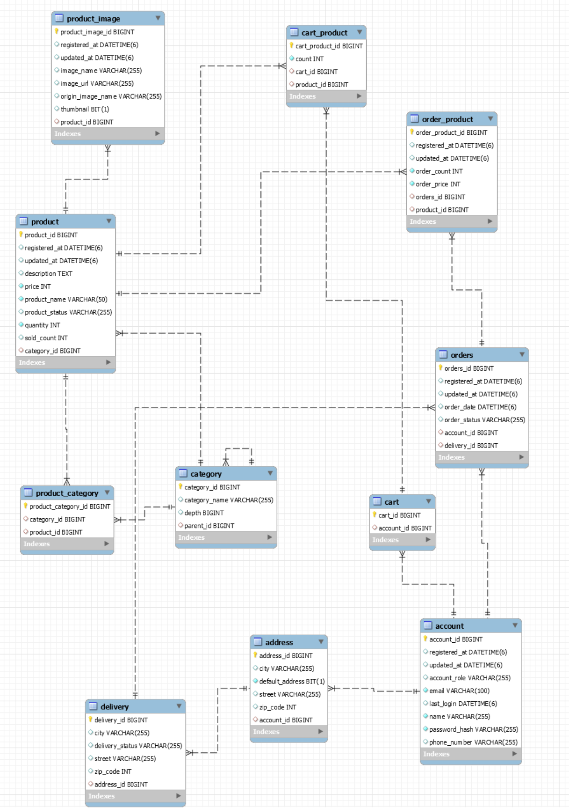
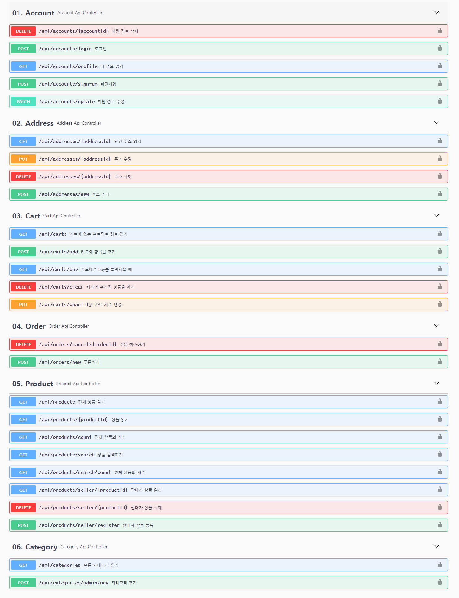

# JUIN-STORE/Spring-Backend

---
# 0. 프로젝트 설명
```text
JUIN-STORE는 얼굴 사진을 올리면 퍼스널 컬러를 진단하고, 그에 맞는 옷을 추천하고 판매하는 웹 서비스다.
JUIN인 이유는 팀원의 이름을 합쳤다.

(비공개) Python-Backend => 퍼스널 컬러를 진단하는 백엔드
(공개)   Spring-Backend => STORE 백엔드  
(공개)   Vue-Frontend => STORE 프론트엔드
```

# 0. 개발 환경
```text
JAVA corretto-17.0.5
MYSQL 8.0.26
Spring Boot 2.4.2
```

# 1. 코딩 컨벤션
[CODING CONVENTION](https://github.com/JUIN-STORE/Spring-Backend/blob/main/CODING-CONVENTION.md)

# 2. API Swagger
```text
http://localhost:13579/swagger-ui/index.html
```

# ERD 구조


# API 목록
